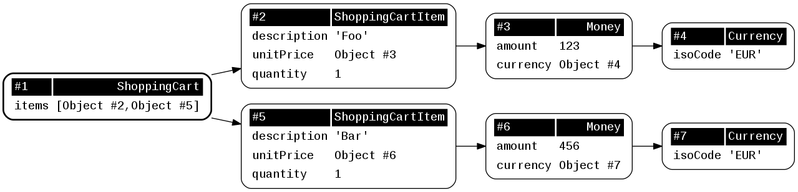

# object-graph

Provides useful operations on PHP object graphs.

[](https://php.net/)
[](https://packagist.org/packages/sebastian/object-graph)
[](https://travis-ci.org/sebastianbergmann/object-graph)
[](https://codecov.io/gh/sebastianbergmann/object-graph)

## Installation

You can add this library as a local, per-project dependency to your project using [Composer](https://getcomposer.org/):

    composer require sebastian/object-graph

If you only need this library during development, for instance to run your project's test suite, then you should add it as a development-time dependency:

    composer require --dev sebastian/object-graph

## Usage

### Object Graph Visualization with GraphViz

```php
<?php
use function SebastianBergmann\ObjectGraph\object_graph_dump;

$cart = new ShoppingCart;
$cart->add(new ShoppingCartItem('Foo', new Money(123, new Currency('EUR')), 1));
$cart->add(new ShoppingCartItem('Bar', new Money(456, new Currency('EUR')), 1));

object_graph_dump('graph.png', $cart);
```


